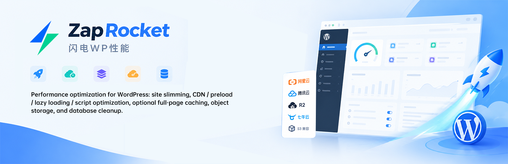
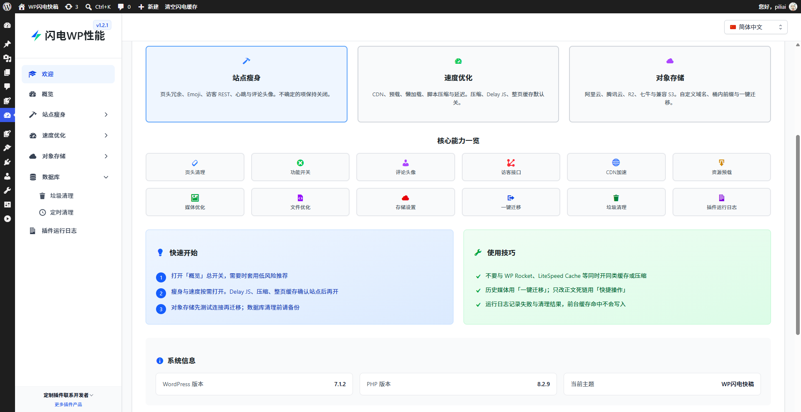
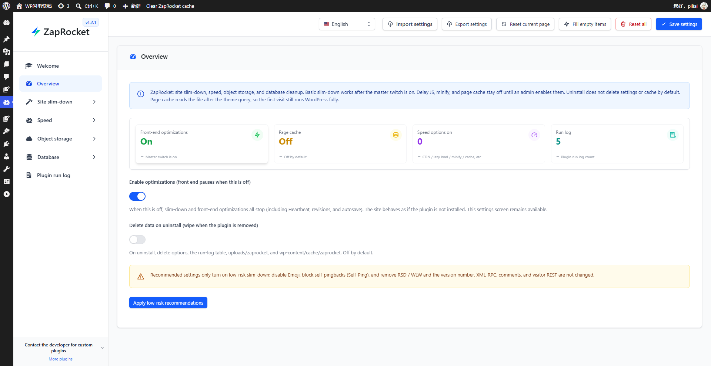
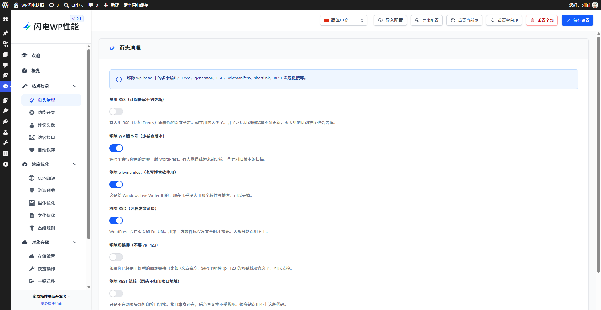
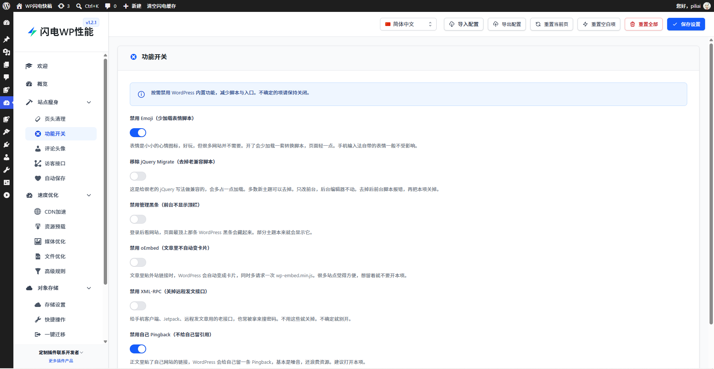
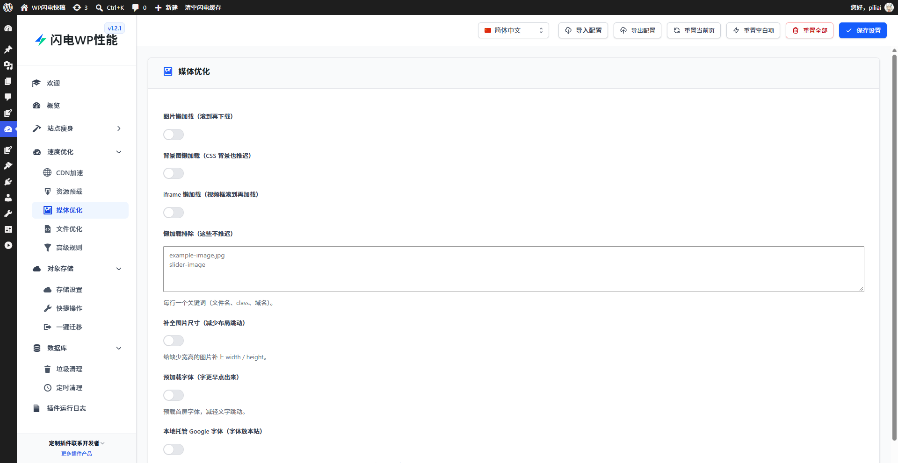
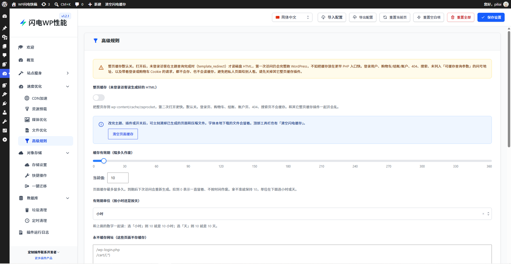
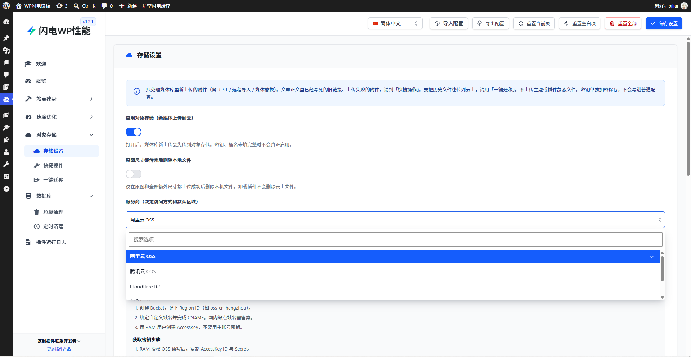
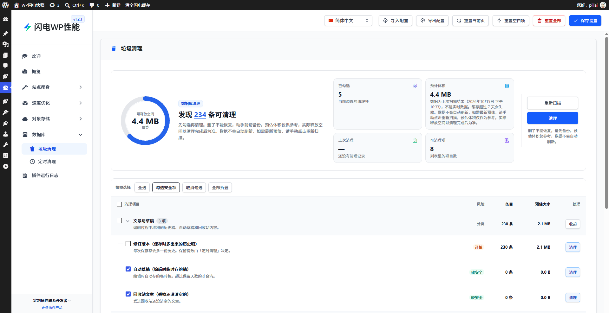
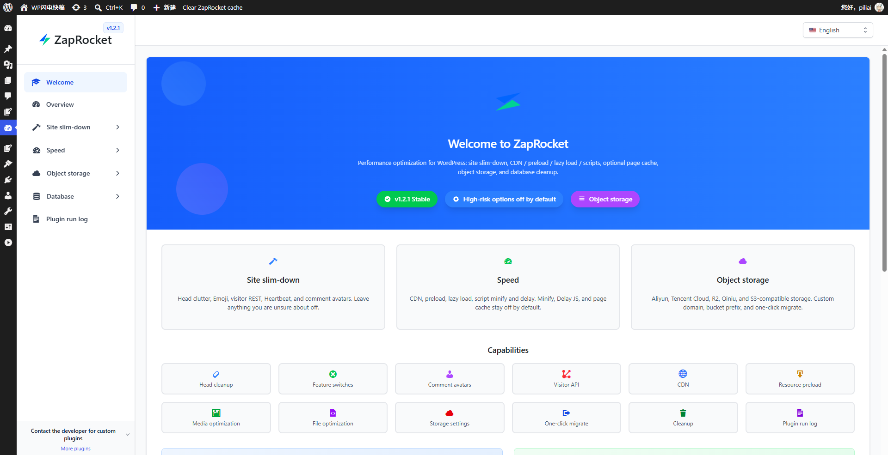

# ZapRocket（闪电WP性能）

**语言 / Language:** [简体中文](README.zh-CN.md) · [English](README.en.md)

WordPress 性能优化插件：站点瘦身、CDN / 预载 / 懒加载 / 脚本、可选整页缓存、对象存储、数据库清理。

> 英文名：**ZapRocket**　中文名：**闪电WP性能**　版本：**1.2.1**  
> 与 [WP Rocket](https://wp-rocket.me/) **无关联**。

<p align="center">
  
</p>

## 界面预览

### 欢迎页

后台欢迎页展示插件简介与核心能力入口。



### 概览

总开关、状态卡片与低风险推荐。



### 站点瘦身

页头清理与功能开关，按需关闭冗余输出。

| 页头清理 | 功能开关 |
|:---:|:---:|
|  |  |

### 速度优化

媒体懒加载、整页缓存与高级规则。

| 媒体优化 | 高级规则 |
|:---:|:---:|
|  |  |

### 对象存储

多云厂商对接：阿里云、腾讯云、R2、七牛与兼容 S3。



### 数据库清理

扫描预估体积后按项清理；动手前请备份。



### 英文界面

插件后台支持中英切换（仅本插件界面，不改站点语言）。



## 功能概览

| 模块 | 说明 |
|------|------|
| 站点瘦身 | 清理页头冗余、Emoji、访客 REST、Heartbeat、评论头像等 |
| 速度优化 | CDN、资源预载、懒加载、CSS/JS 压缩与延迟、可选整页缓存 |
| 对象存储 | 阿里云 OSS、腾讯云 COS、Cloudflare R2、七牛、兼容 S3；自定义域名、桶内前缀、快捷操作、一键迁移 |
| 数据库 | 垃圾清理、定时清理、体积预估 |
| 运行日志 | 记录失败与清理结果（前台缓存命中不写） |

**高风险项默认关闭**（Delay JS、压缩、整页缓存）。请先打开概览总开关，再按需启用。不要与 WP Rocket、LiteSpeed Cache 等同时开启同类整页缓存或压缩。

## 环境要求

- WordPress **5.8+**
- PHP **7.4+**（对象存储的部分厂商能力建议 PHP **8.1+**）
- 需要站点管理员权限进行配置

## 安装

1. 将本仓库目录放到 `wp-content/plugins/`（或安装 [Releases](https://gitcode.com/pilidz/ZapRocket/releases) 中的发行 zip）
2. 确认目录内包含 `pili-core/bootstrap.php`
3. 在「插件」中启用 **ZapRocket / 闪电WP性能**
4. 打开设置：先开概览总开关，再按需打开各分区

## 文档与链接

- 产品页：https://www.pilipost.net/products/zaprocket/
- 更多产品：https://www.pilipost.net/
- 作者：https://gitcode.com/pilidz
- WordPress.org 商店说明（中英对照）：[`readme.txt`](./readme.txt)

## 目录说明

```
zaprocket.php       # 插件入口
admin/              # 后台分区与欢迎页
assets/             # 后台样式与脚本
includes/           # 业务模块（瘦身 / 速度 / OSS / 数据库等）
languages/          # 语言包（文本域：zaprocket-wp）
pili-core/          # 内置设置框架运行时
vendor/             # Composer 依赖（如 AWS SDK）
screenshot-*.png    # 界面截图
.wordpress-org/     # 商店横幅资源
README.md           # 仓库首页（简体中文）
README.zh-CN.md     # 简体中文说明
README.en.md        # English readme
```

## 开发说明

本仓库内容与 **WordPress.org 发行包** 对齐，不包含内部文档、Cursor 配置、i18n 构建源文件等开发附件。

## 许可证

GPLv2 or later。详见 [`license.txt`](./license.txt) 与 [GNU GPL 2.0](https://www.gnu.org/licenses/gpl-2.0.html)。

## 免责声明

使用前请备份站点与数据库。数据库清理与媒体迁移不可轻易撤销。作者不对误操作或与其它缓存插件冲突造成的损失负责。
